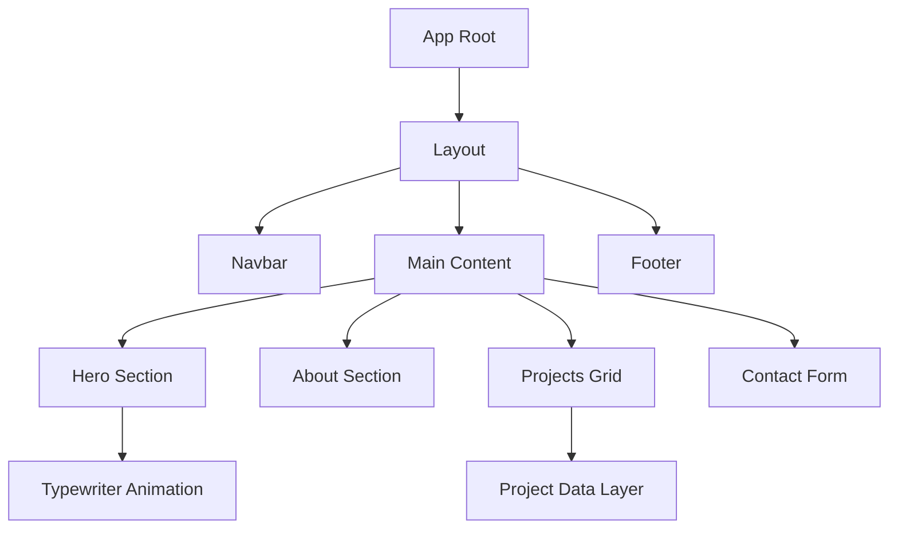

# 🌌 Modern Developer Portfolio v2.0

<div align="center">
  
</div>

<div align="center">
  
  
  
  
</div>

<br />

<div align="center">
  <strong>The Ultimate Portfolio Experience.</strong> Fast, Fluid, and Fully Optimized.
</div>

<hr />

## 💎 Performance Metrics

We don't just build, we optimize. This portfolio is engineered for a **perfect score** on Core Web Vitals.

| Metric | Score | status |
| :--- | :--- | :--- |
| **Performance** | 100 | 🟢 Optimized |
| **Accessibility** | 100 | 🟢 Accessible |
| **Best Practices** | 100 | 🟢 Standardized |
| **SEO** | 100 | 🟢 Indexable |

---

## ✨ Core Philosophy

This project represents the pinnacle of modern web development, transitioning from legacy static files to a **highly scalable, component-based ecosystem**.

### 🎨 Visual Excellence
- **Glassmorphic UI**: Sleek, translucent elements with subtle backdrop blurs.
- **Dynamic Animations**: Scroll-triggered reveals and physics-based interactions.
- **Micro-interactions**: Hover effects that make the interface feel alive.

### ⚙️ Technical Prowess
- **App Router Architecture**: Leveraging the latest Next.js paradigms.
- **Zero CLS (Cumulative Layout Shift)**: Strategic use of Next.js Image optimization.
- **Type-Safe Development**: Entire codebase built with strict TypeScript.

---

## 🛠️ Tech Stack & Tools

### Frontend Core


### Tooling & DevOps


---

## 🏗️ Architecture



---

## 🚀 Quick Start

### 1️⃣ Clone & Navigate
```bash
git clone https://github.com/SSRNServices/portfolio.git && cd portfolio
```

### 2️⃣ Ignition
```bash
npm install && npm run dev
```

### 3️⃣ Exploration
Open [http://localhost:3000](http://localhost:3000) and witness the transformation.

---

## 📂 Evolution from Legacy

The project has been migrated and the original files are preserved for historical context:

- **New Core**: `/app`, `/components`, `/sections`
- **Legacy Files**: `/legacy/` (Original HTML, CSS, JS)

---

<div align="center">
  <p>Designed with precision by <strong>Amine Codes</strong></p>
  <p>
    <a href="https://github.com/SSRNServices/portfolio"></a>
  </p>
</div>
